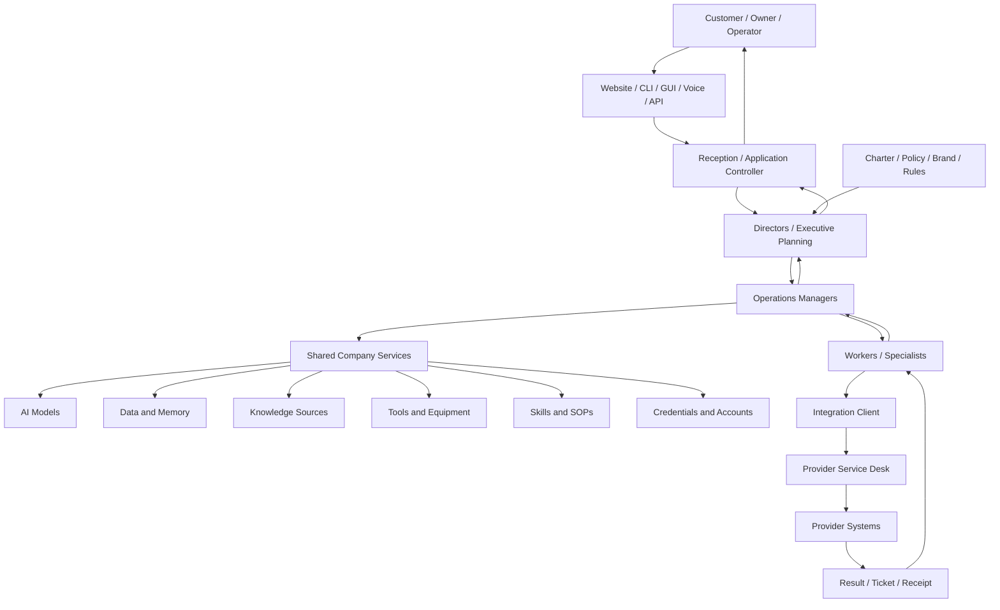

# Business Operations Diagram

## Restaurant parallel

- Reception receives the guest request.
- Directors define the menu and service plan.
- The expediter or manager breaks the order into station work.
- Specialized workers prepare bounded parts.
- Shared equipment and ingredients remain controlled resources.
- Tickets and completed plates return through the expediter.

## Photo-studio parallel

- Management checks cameras, lenses, storage, and credentials out to a scoped shoot.
- Workers do not permanently own company equipment.
- Every asset movement and completed deliverable leaves a record.
