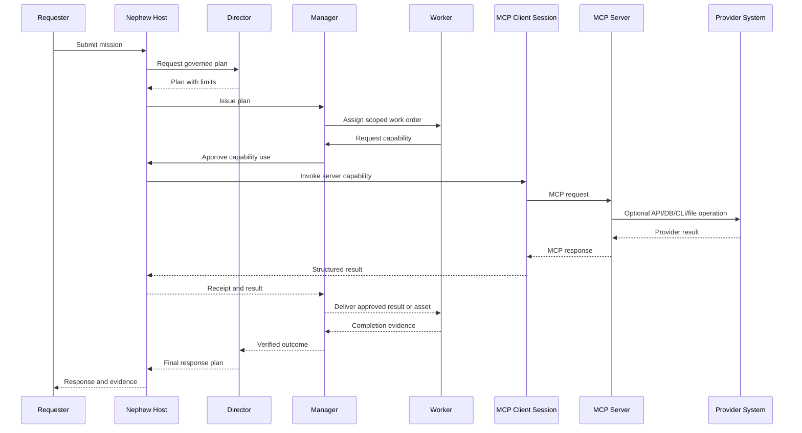

# MCP Communication Diagram

## Boundary rules

- The host owns the client lifecycle, conversation, consent, and policy.
- A client session speaks MCP to one server.
- The server exposes capabilities and may call underlying systems.
- Credentials, transport, MCP, and provider APIs remain distinct layers.
