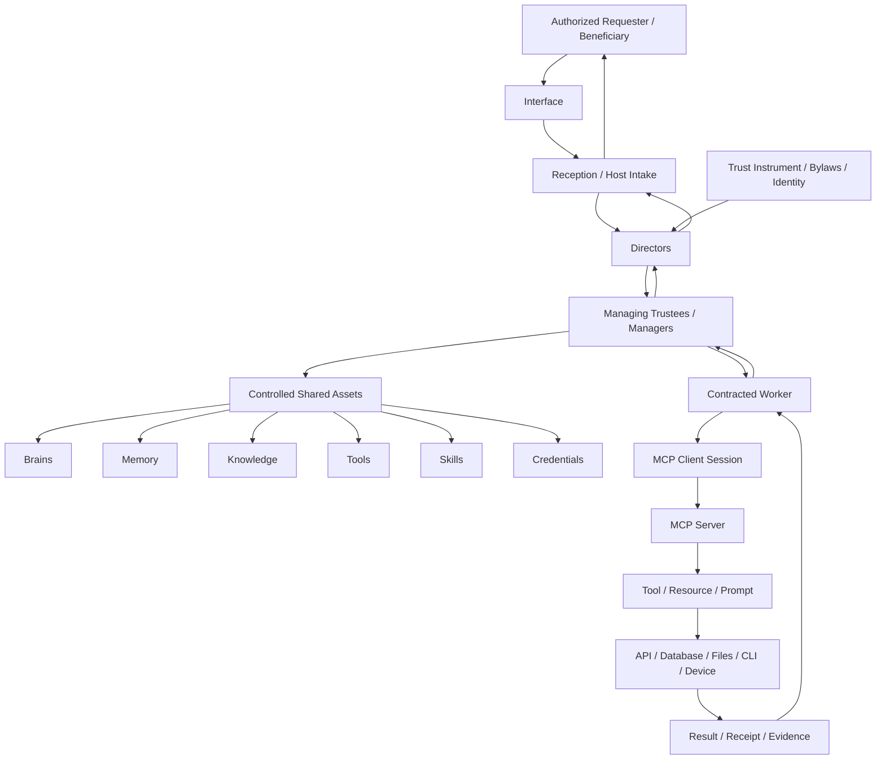

# Trust Architecture Diagram

## Interpretation

- Governance grants authority but does not execute work.
- Directors interpret the trust purpose and create plans.
- Managers issue scoped work orders and control assets.
- Workers execute bounded tasks.
- MCP is the communications layer used to reach service providers.
- Results and evidence return upward through the same accountability chain.
